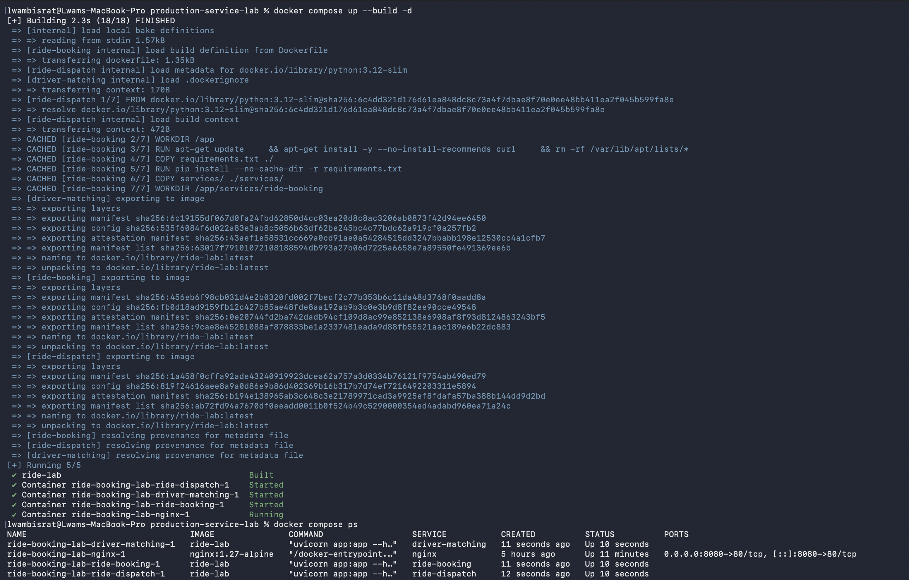
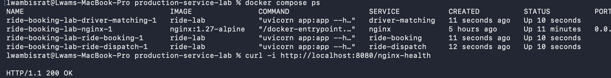
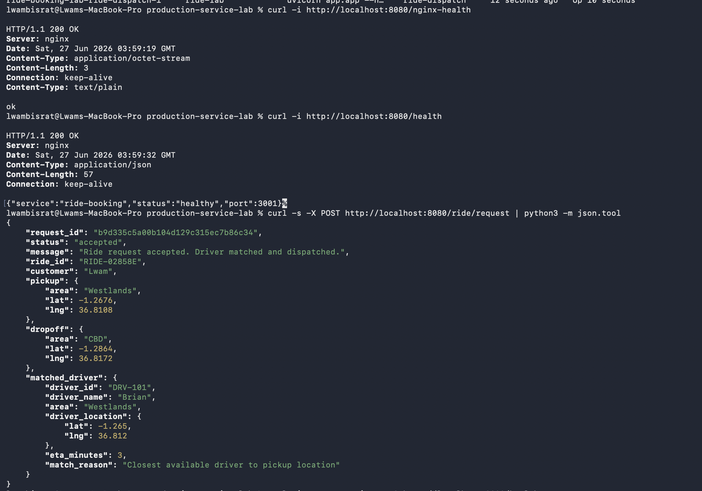
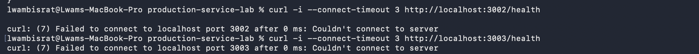
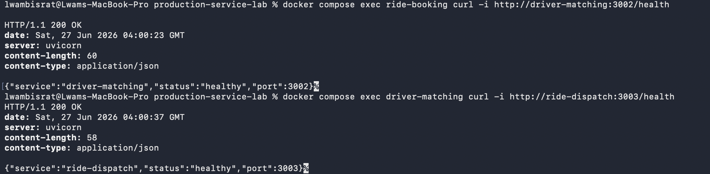
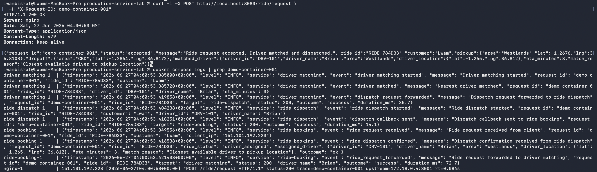
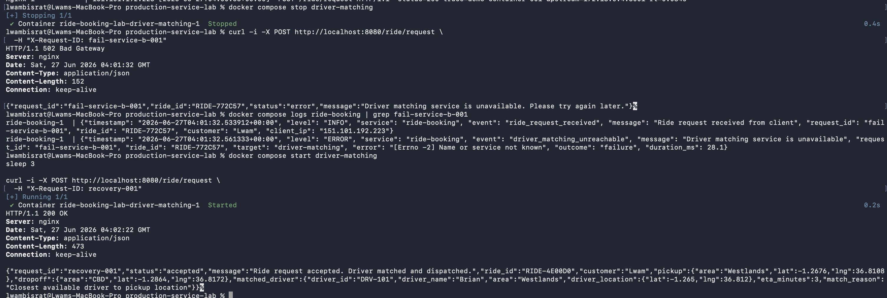

# Container Validation Evidence

Proof that the containerized flow preserves the production behaviour of the
VM version: Nginx is the only public entry point, driver-matching and
ride-dispatch are internal-only, services discover each other by Compose name,
the full chain + callback work, logs are visible via `docker compose logs`, one
request ID traces across services, and stopping a dependency fails cleanly and
recovers.

Every command below was run from the repository root with the Docker daemon
running. Screenshots provide the actual command output for each test.

- **Public route:** `POST http://localhost:8080/ride/request`

---

## 1. Start the system

```bash
docker compose up --build -d
```
Expected: images build, four containers start.

Actual: the shared image built successfully and all four containers started.



**Result: Pass**

## 2. Confirm containers are running

```bash
docker compose ps
```
Expected: `nginx`, `ride-booking`, `driver-matching`, `ride-dispatch` all `running` (Up).

Actual: all four containers report an `Up` status.



**Result: Pass**

## 3. Public entry point works

```bash
curl -i http://localhost:8080/nginx-health           # Nginx itself
curl -i http://localhost:8080/health                 # via Nginx -> ride-booking
curl -s -X POST http://localhost:8080/ride/request | python3 -m json.tool   # full chain
```
Expected: `200 OK`; `/health` returns `{"service":"ride-booking",...}`; the POST
returns `"status":"accepted"` with a `matched_driver`.

Actual: both health routes returned `200 OK`, and the ride request returned
`"status":"accepted"` with driver `DRV-101`.



**Result: Pass**

## 4. driver-matching and ride-dispatch are NOT directly exposed

```bash
curl -i --connect-timeout 3 http://localhost:3002/health   # driver-matching
curl -i --connect-timeout 3 http://localhost:3003/health   # ride-dispatch
```
Expected: connection refused / timeout — they publish no host port.

Actual: connections to host ports 3002 and 3003 were both refused.



**Result: Pass**

## 5. Internal service discovery works (inside the network)

```bash
docker compose exec ride-booking   curl -s http://driver-matching:3002/health
docker compose exec driver-matching curl -s http://ride-dispatch:3003/health
```
Expected: `200` health JSON — services resolve each other by Compose service name.

Actual: `ride-booking` reached `driver-matching:3002`, and `driver-matching`
reached `ride-dispatch:3003`; both returned `200 OK`.



**Result: Pass**

> Note: if the `python:3.12-slim` image has no `curl`, use this instead:
> `docker compose exec ride-booking python -c "import urllib.request,sys; print(urllib.request.urlopen('http://driver-matching:3002/health').read().decode())"`

## 6. Trace one request across services

```bash
curl -s -X POST http://localhost:8080/ride/request -H "X-Request-ID: demo-container-001" >/dev/null
docker compose logs | grep demo-container-001
```
Expected: the same `demo-container-001` appears in ride-booking, driver-matching,
and ride-dispatch logs (and in the Nginx access log as `trace=`), each carrying
the same `ride_id`.

Actual: `demo-container-001` appears in Nginx, ride-booking, driver-matching,
and ride-dispatch logs with ride ID `RIDE-784D33`.



**Result: Pass**

## 7. Stop driver-matching → clean failure, then recover

```bash
docker compose stop driver-matching
curl -s -o /dev/null -w "HTTP %{http_code}\n" \
  -X POST http://localhost:8080/ride/request -H "X-Request-ID: fail-service-b-001"
docker compose logs ride-booking | grep fail-service-b-001
```
Expected: **HTTP 502** with a clear error; ride-booking logs
`driver_matching_unreachable` at ERROR with `outcome=failure`.

Recover:
```bash
docker compose start driver-matching
sleep 3
curl -s -o /dev/null -w "HTTP %{http_code}\n" -X POST http://localhost:8080/ride/request  
```

Actual: stopping `driver-matching` produced `HTTP 502 Bad Gateway`. The
ride-booking log recorded `driver_matching_unreachable` at `ERROR` with
`outcome=failure`. After restarting the service, the recovery request returned
`HTTP 200 OK` with `"status":"accepted"`.



**Result: Pass**

---

## Summary

| # | Test | Result |
|---|------|--------|
| 1 | System starts (`up --build`) | Pass |
| 2 | All four containers running | Pass |
| 3 | Public entry + full chain | Pass |
| 4 | B/C not exposed on host | Pass |
| 5 | Internal discovery by service name | Pass |
| 6 | One request ID traced across services | Pass |
| 7 | Stop-B failure (502) + recovery | Pass |

## Notes on the runtime shift (VM → Compose)

- **Discovery:** `/etc/hosts` `*.internal` names → Docker embedded DNS on the
  Compose network (service names `ride-booking` / `driver-matching` / `ride-dispatch`).
- **Internal-only:** loopback bind + UFW → simply **not publishing** B/C ports;
  inside containers they bind `0.0.0.0` so peers can reach them.
- **Lifecycle:** systemd `Restart=on-failure` → Compose `restart: unless-stopped`.
- **Logs:** `journalctl -u <svc>` → `docker compose logs <svc>` (JSON still on stdout).
